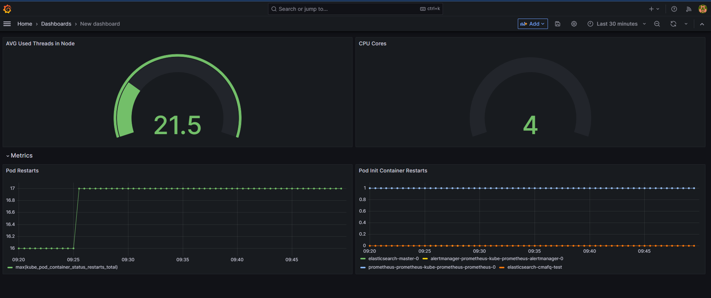

# Для 6 лабораторної

Використовували Elasticsearch як систему централізованого логування.
Встановлювали через команди 

```
helm repo add elastic https://helm.elastic.co
helm install elasticsearch elastic/elasticsearch
```
Логується на POST, PUT, DELETE реквестах на ```api/baskets```, ```api/store```, ```api/orders```

Також додали 4 графіки на Grafana


# Для 5 лабораторної

Використовували RabbitMQ, оскільки більшість членів команди була знайома з ним

Налаштували "відправку емейлів" (```email-service```  - логує на консоль повідомлення типу ```Email ... was sent to ...```), який використовується при створенні користувачів,
та логування змін сутностей ```entity-history``` (ходить в базу та записує в ```entityHistory.EntityChanges```)

Для роботи потрібно встановити RabbitMQ через Helm та додати тестового користувача
(якщо тут змінювати назву реліза, ім'я користувача або пароль, це також треба змінити в файлі ```values.yaml```, розділ ```global```)

```
helm install rabbitmq oci://registry-1.docker.io/bitnamicharts/rabbitmq
kubectl exec rabbitmq-0 rabbitmqctl start_app
kubectl exec rabbitmq-0 rabbitmqctl add_user test test_pass
kubectl exec rabbitmq-0 rabbitmqctl set_user_tags test administrator
kubectl exec rabbitmq-0 rabbitmqctl set_permissions test ".*" ".*" ".*"
```


# Для 4 лабораторної

## retry/timeout

При створенні користувача через POST запит на /api/users також створюється кошик через POST запит на ```/api/baskets``` <br />
Цей запит з ймовірністю 40% буде виконуватись 15с (в налаштуваннях VirtualService timeout = 10s). <br />
Тому, щоб протестувати retry\timeout, достатньо буде кілька разів надіслати POST реквест на ```/api/users``` з таким JSON (всі поля є обов'язковими) 
```
{
    "firstName": "f",
    "lastName": "l",
    "email": "email@mail.com",
    "phoneNumber": "1029387",
    "orderIds": []
}
```

## circuit breaker

Для "поломки" пода треба зробити GET запит на ```/api/store/break```<br />
Тоді один з подів store-service "зламається" і GET запити на ```/api/baskets/test-circuit-breaker```, який запитує дані з  ```/api/store``` буде отримувати 503, що має викликати Circuit Breaker, якщо буде 3 респонси з 5xx статусом за 1 хв